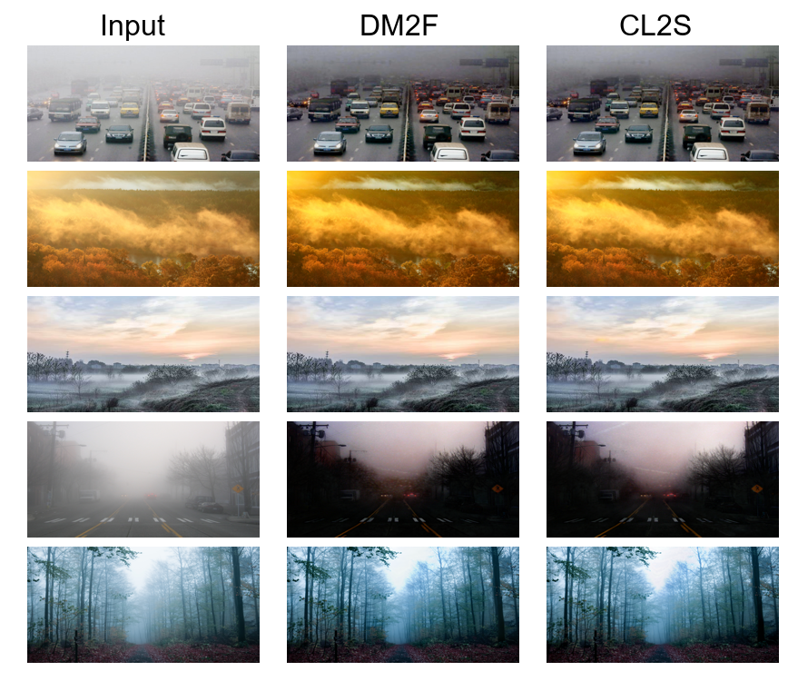

# Rethinking the Elementary function fusion for Single-Image Dehazing

By Yesian Rohn 


Our Model——CL2S means "Change Logarithmic to Sinusoidal function".

## Results

Results on Benchmark：


Results on C-Haze：



The model weights can be found at  [Google Drive](https://drive.google.com/drive/folders/11pAVyD813h5AZmR8bn_aUyUmdIYuGQEC?usp=sharing).

## Installation & Preparation

Make sure you have `Python>=3.7` installed on your machine.

**Environment setup:**

1. Create conda environment

       conda create -n cl2s
       conda activate cl2s

2. Install dependencies (test with PyTorch 1.8.0):

   1. Install pytorch==1.8.0 torchvision==0.9.0 (via conda, recommend).

   2. Install other dependencies

          pip install -r requirements.txt

* Prepare the dataset

   * Download the RESIDE dataset from the [official webpage](https://sites.google.com/site/boyilics/website-builder/reside).

   * Download the O-Haze dataset from the [official webpage](https://data.vision.ee.ethz.ch/cvl/ntire18//o-haze/).

   * Download the HazeRD dataset from the [Baidu Netdisk](https://pan.baidu.com/s/1DgfwitXkSh1U24Ax24ii9g?pwd=Haze).

   * C-Haze is collected by me from the Internet.

   * Make a directory `./data` and create a symbolic link for uncompressed data, e.g., `./data/RESIDE`.

## Training

1. Set the path of datasets in tools/config.py
2. Run by ```python train.py```

Use pretrained ResNeXt (resnext101_32x8d) from torchvision.

*Hyper-parameters* of training were set at the top of *train.py*, and you can conveniently
change them as you need.

Training a model on a single RTX3090 GPU takes about 5 hours.

## Testing

1. Set the path of five benchmark datasets in tools/config.py.
2. Put the trained model in `./ckpt/`.
2. Run by ```python test.py```

*Settings* of testing were set at the top of `test.py`, and you can conveniently
change them as you need.

## License

CL2S is released under the [MIT license](LICENSE).


## Acknowledgments & Citations

We gratefully acknowledge the work of Zijun Deng et al. presented in their ICCV 2019 paper, "Deep Multi-Model Fusion for Single-Image Dehazing". Our project is built upon the foundation laid by their research and the open-source code shared at [DM2F-Net](https://github.com/zijundeng/DM2F-Net).

**Citation Guidance:**

For utilizing ideas or code from this project, please cite:
```
@article{rohn2024rethinking,
  title={Rethinking the Elementary Function Fusion for Single-Image Dehazing},
  author={Rohn, Yesian},
  journal={arXiv preprint arXiv:2405.15817},
  year={2024}
}
```

```
@inproceedings{deng2019deep,
  title={Deep multi-model fusion for single-image dehazing},
  authors={Deng, Zijun; Zhu, Lei; Hu, Xiaowei; Fu, Chi-Wing; Xu, Xuemiao; Zhang, Qing; Qin, Jing; Heng, Pheng-Ann},
  booktitle={IEEE/CVF International Conference on Computer Vision},
  pages={2453--2462},
  year={2019}
}
```
We appreciate the authors' contributions and encourage proper citations to recognize their original work.

